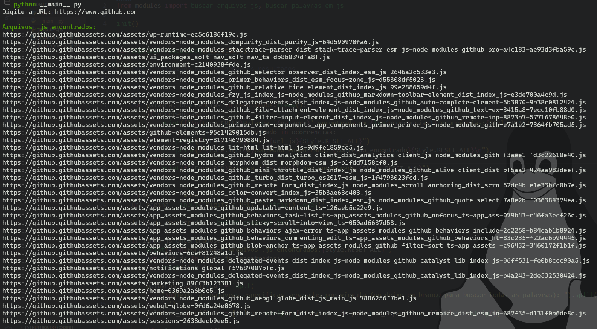
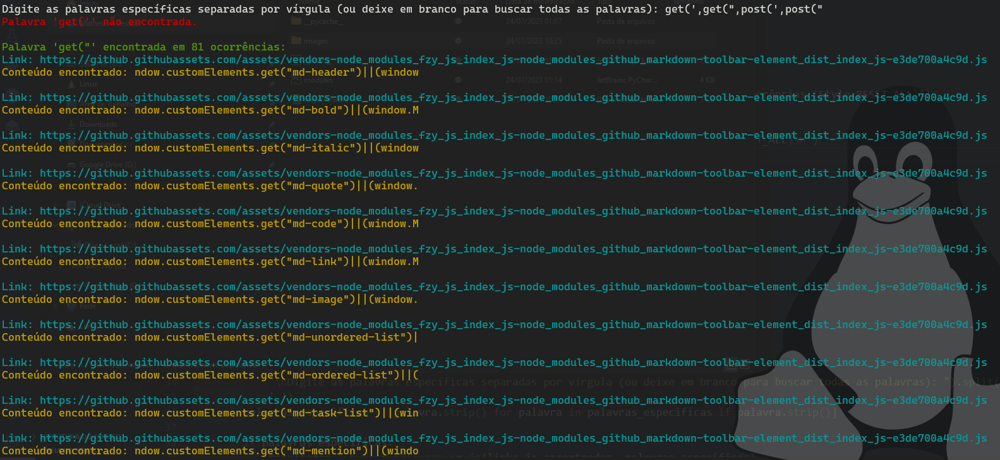

# JSLinkFinder 🕵️‍♂️

  

Uma ferramenta para buscar palavras especificas em arquivos JavaScript presentes em uma párgina Web. O script Python percorre uma URL fornecida pelo usuário, identifica links de arquivos .JS em seguida, procura por palavras específicas fornecidas pelo usuário dentro desses arquivos. 

## Como funciona? 🛠️

1. O usuário insere a URL da página a ser analisada.
2. O script faz uma requisição HTTP à página e procura por links de arquivos .js.
3. Em seguida, o usuário digita as palavras específicas que deseja buscar nos arquivos.
4. O script busca as palavras nas ocorrências encontradas e exibe os resultados coloridos no terminal.

## Pré-requisitos 📋

- Python 3.x instalado
- Bibliotecas Python necessárias (verifique o arquivo requirements.txt)

## Como utilizar? 🚀

1. Clone este repositório para sua máquina local:
2. ```git clone https://github.com/MathzRocha/JSLinkFinder.git```
3. Instale as dependências:
4. ```pip install -r requirements.txt```
5. Execute o script:
6. ```python3 __main__.py```
7. Digite a URL da página que deseja analisar e, em seguida, digite as palavras específicas que deseja buscar.

## Exemplo de saída 📄





---
## Contribuições 👥

Contribuições são bem-vindas! Sinta-se à vontade para abrir issues, propor melhorias ou enviar pull requests.

## Licença 📜

Este projeto está licenciado sob a [Licença GPL-3.0 license](LICENSE).

---
Inspirado por [m4ll0k]([https://github.com/m4ll0k/SecretFinder])

Feito por [MathzRocha]([https://github.com/seu-usuario](https://github.com/MathzRocha)https://github.com/MathzRocha) e [pedrobastosm]([https://github.com/pedrobastosm])
